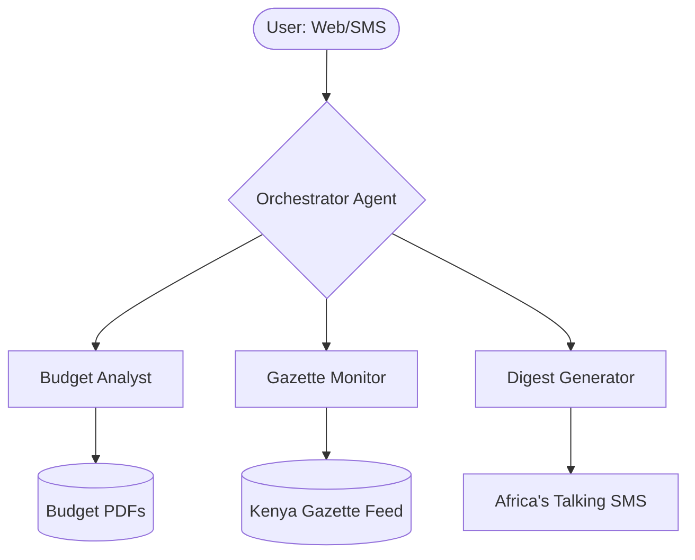

# 🐕 County Budget Watchdog
### Bridging the gap between 400-page budget PDFs and Kenyan citizens.

> **Project Mission**: To democratize access to county financial data by transforming complex budget documents into plain-language insights, monitoring official amendments in real-time, and reaching citizens where they are—via web and SMS.

---

## 📖 Project Overview
Every year, Kenyan counties publish massive budget documents (often 400+ pages). For the average ward resident, these documents are inaccessible, filled with technical jargon, and difficult to navigate. This lack of transparency allows for "leakage" between allocation and expenditure.

**County Budget Watchdog** is an AI-powered multi-agent system designed to:
1.  **Simplify**: Turn dense PDFs into conversational, plain-language answers.
2.  **Monitor**: Automatically track the Kenya Gazette for budget amendments and re-allocations.
3.  **Reach Out**: Generate and send concise SMS budget digests to residents who may not have high-speed internet access.

## 🎯 Scope of Work

### Core Features (In-Scope)
- **Conversational Budget Analyst**: A specialized agent that "reads" 400-page PDFs using Gemini 1.5 Pro's long-context window to answer ward-specific questions.
- **Kenya Gazette Monitor**: An automated scanner that identifies official notices affecting county budgets and summarizes their impact.
- **SMS Digest Engine**: Integration with Africa's Talking to deliver bite-sized budget updates (under 160 characters) to any Kenyan mobile number.
- **Multi-Agent Orchestration**: A central "brain" that routes user queries to the correct specialist agent (Analyst, Monitor, or Generator).

### Technical Architecture
The system is built on a **Hierarchical Multi-Agent Pattern**, ensuring that each task is handled by a specialized LLM instance with the appropriate tools.



#### The Specialist Agents:
- **Orchestrator**: Acts as the router. It parses user intent, delegates tasks, and maintains session memory.
- **Budget Analyst**: Equipped with the Gemini Files API to process long-form documents. It handles queries like *"How much was allocated to clinics in Kibra?"*
- **Gazette Monitor**: Scans for legislative changes. It identifies when a budget is amended mid-year—a common point of "leakage."
- **Digest Generator**: A specialist in brevity. It translates complex findings into 160-character Swahili or English SMS messages.

## 🛠️ Tech Stack
- **Framework**: Next.js 15 (App Router), TypeScript.
- **AI Intelligence**: Gemini 1.5 Pro (via Google AI SDK).
- **Communication**: Africa's Talking API (SMS).
- **Processing**: Gemini Long-Context (1M+ tokens) for PDF analysis.
- **Deployment**: Google Cloud Run (Containerized).

---

## 🚀 Getting Started

### Prerequisites
- Node.js 20+
- A Google AI Studio API Key ([Get one here](https://aistudio.google.com/))
- (Optional) Africa's Talking API credentials for real SMS delivery.

### Installation
1.  **Clone the repository**:
    ```bash
    git clone https://github.com/agentathon-27/agentathon-27.git
    cd agentathon-27
    ```
2.  **Install dependencies**:
    ```bash
    npm install
    ```
3.  **Environment Setup**:
    Create a `.env.local` file:
    ```env
    GOOGLE_API_KEY=your_gemini_key_here
    AT_USERNAME=sandbox
    AT_API_KEY=your_at_key_here
    ```
4.  **Run Development Server**:
    ```bash
    npm run dev
    ```
    Open [http://localhost:3000](http://localhost:3000) to interact with the agent.

---

## 📈 Future Roadmap
- [ ] **Document AI Integration**: Move from raw PDF text to structured table extraction for more precise financial comparisons.
- [ ] **BigQuery Historical Analysis**: Store budget data across multiple years to track spending trends over time.
- [ ] **Multi-Language Support**: Expand beyond English/Swahili to support more local dialects.
- [ ] **Push Alerts**: Enable residents to "subscribe" to specific wards or departments for instant SMS updates when allocations change.

---

## 👥 The Team
*Built with ❤️ during the GDG Nairobi Agentathon 2026.*

| Name | Role |
|---|---|
| [Team Member Name] | Lead Developer |
| [Team Member Name] | AI & Prompt Engineering |
| [Team Member Name] | Product & UX |
| [Team Member Name] | DevOps |

---
*This project was developed as part of the GDG Nairobi Agentathon 2026 Challenge Track 04.*
